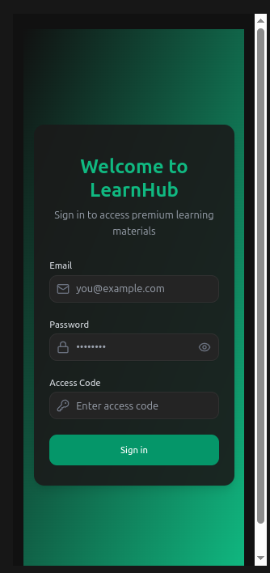
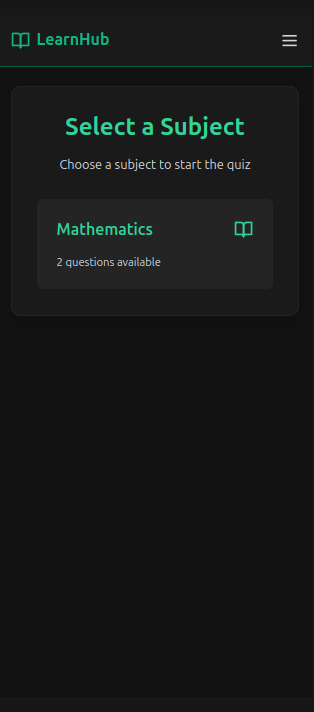
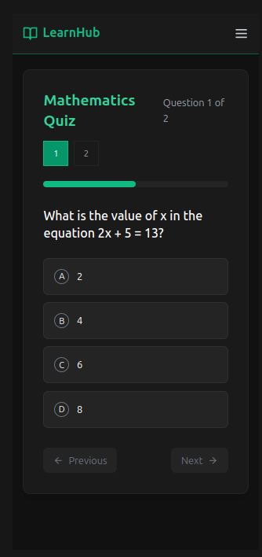

Edubim adalah projek eksperimental yang terinspirasi dari aplikasi ujian yang digunakan di sekolah. Projek ini dibuat sebagai sarana pembelajaran untuk memahami bagaimana aplikasi ujian berfungsi dari sisi teknis. Saat ini, projek masih dalam tahap pengembangan awal dan belum mengimplementasikan database.

**Fitur**

✅ Antarmuka ujian yang sederhana dan intuitif

✅ penggunaan tipe soal pilihan ganda agar simpel

✅ Hasil ujian langsung (tanpa penyimpanan)

🚧 Penyimpanan data (belum diimplementasikan)

**Alur kerja aplikasi ujian**

Manajemen state dalam aplikasi
Penanganan timer dan validasi jawaban
Antarmuka pengguna yang ramah untuk konteks ujian

**Teknologi**

HTML, CSS, JavaScript
[Framework yang digunakan React dan Tailwind CSS]

**Screenshot**

**Rencana Pengembangan**

 Implementasi database untuk penyimpanan soal dan jawaban
 Fitur login untuk guru dan siswa
 Dashboard admin untuk pembuatan ujian
 Analisis hasil ujian
 Mode offline

**Catatan**

Projek ini dibuat murni untuk tujuan pembelajaran dan eksplorasi. Tidak direkomendasikan untuk digunakan dalam lingkungan ujian sesungguhnya tanpa pengembangan lebih lanjut, terutama pengimplementasian database dan fitur keamanan.
